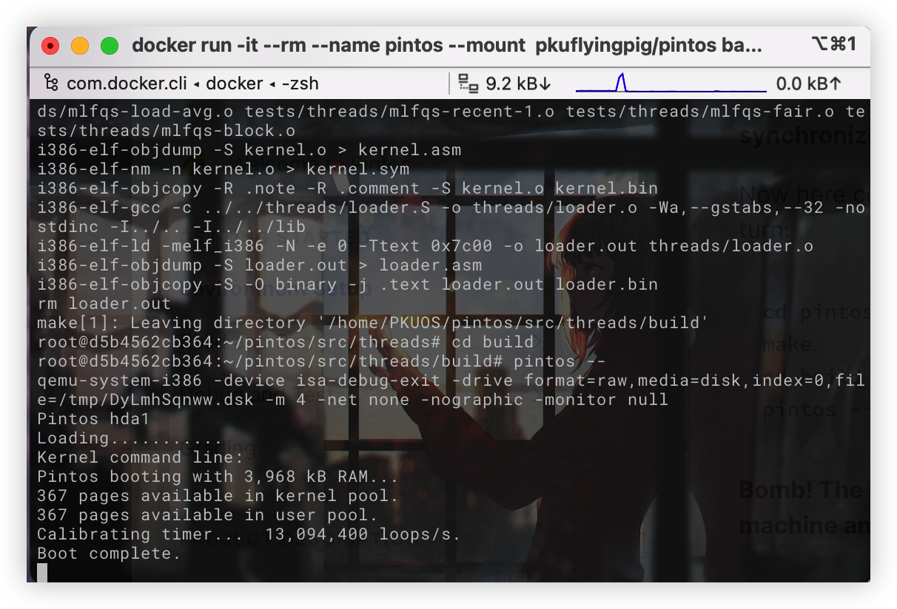
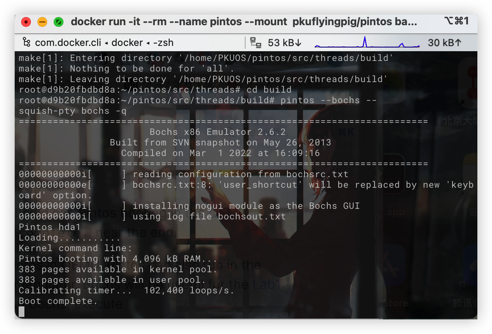
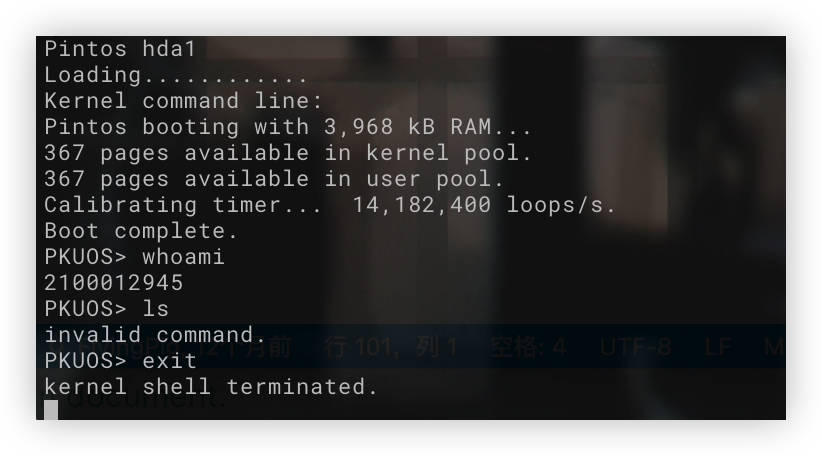

# Project 0: Getting Real

## Preliminaries

> Fill in your name and email address.

寿晨宸 <2100012945@stu.pku.edu.cn>

> If you have any preliminary comments on your submission, notes for the TAs, please give them here.
> Please cite any offline or online sources you consulted while preparing your submission, other than the Pintos documentation, course text, lecture notes, and course staff.

1. [Wikipedia: BIOS interrupt call](https://en.wikipedia.org/wiki/BIOS_interrupt_call)

## Booting Pintos

> A1: Put the screenshot of Pintos running example here.

QEMU:



Bochs:



## Debugging

### QUESTIONS: BIOS

> B1: What is the first instruction that gets executed?

``ljmp   $0x3630,$0xf000e05b``

> B2: At which physical address is this instruction located?

``0xffff0``

### QUESTIONS: BOOTLOADER

> B3: How does the bootloader read disk sectors? In particular, what BIOS interrupt is used?

1.Use the function 'read_sector'
2.Interrupt vector is 0x13, which means 'low level disk services', and the AH is 0x42, which means 'extended read sectors'. So the BIOS interrupt is Extended Read Sectors'.

> B4: How does the bootloader decides whether it successfully finds the Pintos kernel?

1. Check for MBR signature--if not 0xaa55, it's not a partitioned hard disk (loader.S: line 67), turn to the next disk.
2. Offset of partition table entry 1 to check the first partition. (value 446, line 70) If the result is 0, it means that the partition is unused, then jump to the next partition. (line 74) Else, go on.
3. Check if it is a Pintos kernel partition (value 0x20, line 81). If so, go on, else, jump to the next partition.
4. Check if it is a bootable partition (value 0x80, line 85). If so, it means we have found the Pintos Kernel, else, jump to the next partition.

> B5: What happens when the bootloader could not find the Pintos kernel?

Didn't find a Pintos kernel partition anywhere, give up. Print "Not Found". Then call BIOS interrupt 0x18. It would send an error message stating that no bootable disk was present, usually treated by the BIOS as a signal from the bootloader that it failed to complete its task. The BIOS can then take appropriate next steps.

> B6: At what point and how exactly does the bootloader transfer control to the Pintos kernel?

1. Read the sectors one by one from the disk and load them in the memory space starting from address 0x20000.
2. Transfer control to the kernel that we loaded.  We read the start address out of the ELF header (0x18) and convert it from a 32-bit linear address into a 16:16 segment:offset address for real mode, then jump to the converted address.

### QUESTIONS: KERNEL

> B7: At the entry of pintos_init(), what is the value of expression `init_page_dir[pd_no(ptov(0))]` in hexadecimal format?

``0x0``

> B8: When `palloc_get_page()` is called for the first time,
>
>> B8.1 what does the call stack look like?
>>
>> ```bash
>> #0  palloc_get_page (flags=(PAL_ASSERT | PAL_ZERO)) at ../../threads/palloc.c:113
>> #1  0xc00203aa in paging_init () at ../../threads/init.c:168
>> #2  0xc002031b in pintos_init () at ../../threads/init.c:100
>> #3  0xc002013d in start () at ../../threads/start.S:180
>> ```
>>
>> B8.2 what is the return value in hexadecimal format?
>>
>> ``(void *) 0xc0101000``
>>
>> B8.3 what is the value of expression `init_page_dir[pd_no(ptov(0))]` in hexadecimal format?
>>
>> ``0x0``
>>
>
> B9: When palloc_get_page() is called for the third time,
>
>> B9.1 what does the call stack look like?
>>
>> ```bash
>> #0  palloc_get_page (flags=PAL_ZERO) at ../../threads/palloc.c:113
>> #1  0xc0020a81 in thread_create (name=0xc002e895 "idle", priority=0, function=0xc0020eb0 <idle>, aux=0xc000efbc) at ../../threads/thread.c:178
>> #2  0xc0020976 in thread_start () at ../../threads/thread.c:111
>> #3  0xc0020334 in pintos_init () at ../../threads/init.c:119
>> #4  0xc002013d in start () at ../../threads/start.S:180
>> ```
>>
>> B9.2 what is the return value in hexadecimal format?
>>
>> ``(void *) 0xc0103000``
>>
>> B9.3 what is the value of expression `init_page_dir[pd_no(ptov(0))]` in hexadecimal format?
>>
>> ``0x102027``
>>

## Kernel Monitor

> C1: Put the screenshot of your kernel monitor running example here. (It should show how your kernel shell respond to `whoami`, `exit`, and `other input`.)



> C2: Explain how you read and write to the console for the kernel monitor.

Depending on function ``input_getc()`` implemented by file ``devices/input.c``, the program reads the input characters one by one. (All print operations depend on the function ``print`` implemented by file ``lib/stdio.c``)

- If the character is ``\r``, the program would print ``\r\n`` to give a new line,  parse the whole command line in the buffer and then go to the next cycle.
- If the character is ``backspace``, the program would delete the last typed character both in the shell and the buffer, and then repeat above operations.
- If the character is printable, the program would display it and put it in the buffer. Then repeat above operations.

To parse the command line:

- If the command line is ``whoami``, the program would print my student id: ``2100012945``.
- If the command line is ``exit``, quit the shell and then print ``kernel shell terminated.``
- Else, print ``invalid command.``.

After that, give a new line and print ``PKUOS>``.
