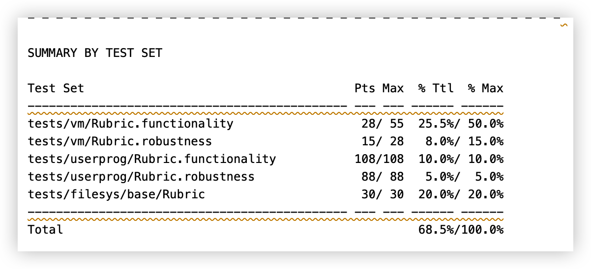

# Project 3a: Virtual Memory

## Preliminaries

>Fill in your name and email address.

寿晨宸 <2100012945@stu.pku.edu.cn>

>If you have any preliminary comments on your submission, notes for the TAs, please give them here.

lab3a 中所有的测试都是通过的。


>Please cite any offline or online sources you consulted while preparing your submission, other than the Pintos documentation, course text, lecture notes, and course staff.

## Page Table Management

### DATA STRUCTURES

>A1: Copy here the declaration of each new or changed struct or struct member, global or static variable, typedef, or enumeration.  Identify the purpose of each in 25 words or less.

```c
/* 记录 page 在何处 */
enum page_status
{
    PAGE_BLANK, /* 空白页，只存在于页表中 */
    PAGE_FRAME, /* 在物理内存中 */
    PAGE_SWAP,  /* 在 swap slot(disk) 中 */
    PAGE_FILE   /* 在文件系统中 */
};
/* 补充页表项 */
struct supplemental_pte
{
    /* 用户虚拟地址 */
    void *page_addr;
    /* 该页所在位置 */
    enum page_status status;
    /* 因为页表以哈希表的形式组织，所以 pte 需要提供哈希表的句柄 */
    struct hash_elem hash_e;
    /* 是否被修改过 */
    bool dirty;
    /* 是否可写 */
    bool writable;

    /* PAGE_FRAME */
    void *frame_addr;

    /* PAGE_SWAP */
    swap_index_t swap_index;

    /* PAGE_FILE */
    /* 文件 */
    struct file *file;
    /* 文件偏移量 */
    off_t file_offset;
    /* read_bytes+zero_bytes=PG_SIZE，
    一般将 page_addr+read_bytes 开始的 zero_bytes 置为 0 */
    uint32_t read_bytes;
    uint32_t zero_bytes;
};
struct thread
{
    /**< 补充页表，以哈希表的形式存在. */
    struct hash *spage_table;   
}
```

### ALGORITHMS

>A2: In a few paragraphs, describe your code for accessing the data
>stored in the SPT about a given page.

对每个进程维护一个 SPT。SPT 是以页虚拟地址为索引的哈希表，存储进程所有虚拟页的增广页表项。
当提供某个虚拟页地址时，就可以通过哈希表访问对应的数据。

>A3: How does your code coordinate accessed and dirty bits between
>kernel and user virtual addresses that alias a single frame, or
>alternatively how do you avoid the issue?

在 spte 中维护一个 dirty 位，初始化为 false。
当某个 frame 被驱逐到 swap slot 中时，通过 pagedir_is_dirty() 函数同时检查 upage/kpage，并将 dirty 位设为两者的或。
但在 lab3a 中事实上并没有用到 dirty 位，这是在为后面实现 mmap 和 munmap 做准备。与实际访问无关，只是在 spte 中维护了一个 dirty 位，仅此而已。
另外，事实上我只通过使用帧结构上的 PTE 或用户虚拟内存地址来访问内存，而避免从内核虚拟内存访问它。

### SYNCHRONIZATION

>A4: When two user processes both need a new frame at the same time,
>how are races avoided?

首先，我添加了一个 lock_frames，用于处理竞争。
当 frames 足够时，只需要按照顺序持锁就能实现同步。
当 frames 满了，就需要将某个 frame 驱逐到 swap slot 中（此处使用时钟算法）。大抵顺序如下，不妨假设我们有进程 A，B。

1. 进程 A 持有锁，进程 B 等待。
2. 进程 A 分配 frame 失败，用时钟算法选出某个 frame 驱逐出去，然后再次尝试分配 frame（一定会成功，如果程序设计正确的话）。
3. A 释放锁。
4. B 获得锁。
5. 进程 B 分配 frame 失败，用时钟算法选出某个 frame 驱逐出去，然后再次尝试分配 frame。
6. B 释放锁。

### RATIONALE

>A5: Why did you choose the data structure(s) that you did for
>representing virtual-to-physical mappings?

我使用哈希表来实现 frame table，因为这是最高效的。同时，为了实现时钟算法，我维护了一个 clock_list 的列表用于轮转遍历所有 frame。

为每个进程维护一个增广列表，并用哈希表实现它的想法也是自然且高效的。

因为实际上每个页不可能如初始状态所言只在对某个进程而言同一的地址空间中，它有可能在文件系统/frames/swap slot 或仅仅只在页表项中（为实现 lazy load），所以必须要有某个增广页表来维护从虚拟地址到物理地址的映射。

## Paging To And From Disk

### DATA STRUCTURES

>B1: Copy here the declaration of each new or changed struct or struct member, global or static variable, typedef, or enumeration.  Identify the purpose of each in 25 words or less.

```c
/* 物理页表，以物理页地址为索引 */
struct hash frame_table;

/* 各物理页的时钟列表，用于时钟算法选取要驱逐的页 */
struct list clock_list;

/* 时钟指针 */
struct list_elem *clock_hand;

struct frame_info
{
    /* 是否允许被置换出去 */
    bool pinned;
    /* 物理页地址 */
    void *frame_addr;
    /* 虚拟页地址 */
    void *page_addr;
    /* 页表地址 */
    uint32_t *pte;
    /* 指向所属进程的指针 */
    struct thread *owner_thread;
    /* 物理页以哈希表的形式组织 */
    struct hash_elem hash_e;
    /* 时钟列表的句柄 */
    struct list_elem list_e;
};
```

### ALGORITHMS

>B2: When a frame is required but none is free, some frame must be
>evicted.  Describe your code for choosing a frame to evict.

时钟算法。
遍历两次列表（因为只遍历一次的话可能因为所有 frame 的 access 位都为真而找不到可驱逐的 frame）。
每次遍历中，具体做以下事情：

1. 将时钟指针指向下一帧。
2. 访问对应的页表项，若 pinned 为真，说明该 frame 被钉住了，无法被驱逐，跳到步骤 1。
3. 通过 pagedir_is_accessed 访问该 frame 的 access 位，若为真，说明该 frame 刚被访问过，跳过该 frame，并将 access 位设为假，跳到步骤 1。
4. 若抵达此处，则时钟指针指向的 frame 就是要驱逐的 frame，结束遍历。

>B3: When a process P obtains a frame that was previously used by a
>process Q, how do you adjust the page table (and any other data
>structures) to reflect the frame Q no longer has?

使用 pagedir_clear_page(Q->pagedir,vaddr)，移除 Q 对该 frame 的引用。

### SYNCHRONIZATION

>B5: Explain the basics of your VM synchronization design.  In
>particular, explain how it prevents deadlock.  (Refer to the
>textbook for an explanation of the necessary conditions for
>deadlock.)

我只对 frames 加锁，因为 spte 是进程独占的，不必考虑同步。而访问 swap 必须经由 frame，在实现 frame 的同步时顺便也可以实现 swap 的同步。
frames 的同步是显然的，只需要对所有操作 frames 的函数加锁即可，使每步操作都是原子的。

至于对 swap 的操作，可以分成两部分来看。
因为只有在逐出某个 frame 时，才会将逐出的 frame 写入 swap slot 中，而前者已经用 lock_frames 实现了同步，后者包裹在前者中，自然也实现了同步。
从 swap slot 中换出时，是先调用了 vm_alloc_frame()（已经用 lock_frames 实现了同步），之后向某个页中写的操作已经与全局无关。同时单个 frame 又是进程独占的，不必考虑多进程读同一 frame 的情况，所以不会出现竞争。

>B6: A page fault in process P can cause another process Q's frame
>to be evicted.  How do you ensure that Q cannot access or modify
>the page during the eviction process?  How do you avoid a race
>between P evicting Q's frame and Q faulting the page back in?

当 P 驱逐 frame f 时，会使用 pagedir_clear_page(Q->pagedir,vaddr)，移除 Q 对该 frame 的引用。同时，占用锁 lock_frames。
此时，当 Q 访问该 frame 时，会触发 page fault。检查 SPT，会发现该页在 swap 上，所以请求将该页从 swap 加载到 frames 中，并申请 lock_frames，所以会等待 P 驱逐成功后，Q 再实行驱逐，并加载页到 frames 中。

>B7: Suppose a page fault in process P causes a page to be read from
>the file system or swap.  How do you ensure that a second process Q
>cannot interfere by e.g. attempting to evict the frame while it is
>still being read in?

当某个 frame 正在被读/写时，其 pinned 项将被设为 true，这意味这这个 frame 将无法被逐出。

>B8: Explain how you handle access to paged-out pages that occur
>during system calls.  Do you use page faults to bring in pages (as
>in user programs), or do you have a mechanism for "locking" frames
>into physical memory, or do you use some other design?  How do you
>gracefully handle attempted accesses to invalid virtual addresses?

发生 page fault 后，首先会检查 SPT，若该页在 SPT 中，则会将该页加载回 frames。
若该页在进程栈的合法地址范围内，则会进行栈增长。

对于无效地址，有以下解决方式。

1. 像 lab2 中一样，在系统调用之前显式地检查地址，若地址无效，终止进程。
2. 直接访问无效地址时，发生 page fault，若该地址不符合上文中加载页到 frames 中的条件，直接终止进程。
3. 在 SPT 中维护 writable 项，在映射时使用 pagedir_set_page 将 SPT 中的 writable 项同步到页表中的 writable 项。 若访问只读的地址，终止进程。

### RATIONALE

>B9: A single lock for the whole VM system would make
>synchronization easy, but limit parallelism.  On the other hand,
>using many locks complicates synchronization and raises the
>possibility for deadlock but allows for high parallelism.  Explain
>where your design falls along this continuum and why you chose to
>design it this way.

我只使用了一个锁（lock_frames），并通过比较巧妙的设计避免了竞争和死锁。对于所有要加锁的资源而言，这是简明而高效的。因为我显然不可能为每个 frame 加一个锁，额外的为 swap slot 加锁也是不必要的。对于 SPT 而言，能访问它的只有用户本身和内核，所以相比于试图为每个进程加一个锁，我更愿意只用一个锁来实现同步。
