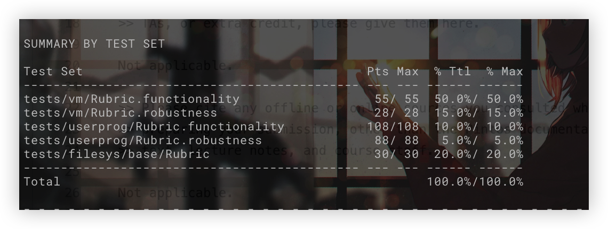

# Project 3b: Virtual Memory

## Preliminaries

>Fill in your name and email address.

寿晨宸 <2100012945@stu.pku.edu.cn>

>If you have any preliminary comments on your submission, notes for the TAs, please give them here.

All tests pass.



>Please cite any offline or online sources you consulted while preparing your submission, other than the Pintos documentation, course text, lecture notes, and course staff.

## Stack Growth

### ALGORITHMS

>A1: Explain your heuristic for deciding whether a page fault for an
>invalid virtual address should cause the stack to be extended into
>the page that faulted.

1. The address of the page (rounded down to the nearest page boundary) must be within the allocated stack space.
2. The page address(rounded) has not been assigned in the SPTE. Otherwise I just need to lazy load it.
3. Check the stack pointer. If the invalid address accessed by user, I use f->esp as esp, else if the address accessed by kernel, which means the f->esp is undefined, so I use the thread_current()->stack_esp to obtain the esp. The page address(unrounded) must be within 32 bytes of the threads' stack pointer, which include the cases of the PUSH and PUSHA commands.

## Memory Mapped Files

### DATA STRUCTURES

>B1: Copy here the declaration of each new or changed struct or struct member, global or static variable, typedef, or enumeration.  Identify the purpose of each in 25 words or less.

```c
typedef int mapid_t;
#define MMERROR -1

/* Information of mapped file */
struct mmap_file
{
    /* Unique mapid, process exclusive */
    mapid_t mapid;
    /* The file mapped */
    struct file *file;
    /* The address mapped to */
    void *uvaddr;
    /* File size */
    size_t size;
    /* A handle to the mmap_files hash table in the process */
    struct hash_elem hash_e;
};
struct thread
{
    /* Hash table composed of mmap_file and indexed by mapid. */
    struct hash *mmap_files; 
    /*Count from zero, record the currently allocated maximum mapid, used to allocate the next mapid */  
    mapid_t max_alloc_mapid;   
};
```

### ALGORITHMS

>B2: Describe how memory mapped files integrate into your virtual
>memory subsystem.  Explain how the page fault and eviction
>processes differ between swap pages and other pages.

Memory mapped files are encapsulated in a struct called mmap_file, which contains a unique mapid, a refenrence to its address, and the info of file mapped.

Each process contains a hash table mmap_files composed of mmap_file and indexed by mapid.

Syscall mmap will load file into memory and get a mapid. Syscall munmap will free
the memory and check if the corresponding pages are dirty, if they are dirty,
the page content needs to write back to the file, otherwise, just free the
pages. When a process exits, it will free all its memory mapped files.

The pages belonging to memory mapped files would be managed as same as other pages within page fault or eviction.

>B3: Explain how you determine whether a new file mapping overlaps
>any existing segment.

Before I map the file, I would check all page address the file would be mapped to. If any entry in the Pintos original page table or the supplemental page table contains the correspond page address, I would terminate the syscall and return -1.

### RATIONALE

>B4: Mappings created with "mmap" have similar semantics to those of
>data demand-paged from executables, except that "mmap" mappings are
>written back to their original files, not to swap.  This implies
>that much of their implementation can be shared.  Explain why your
>implementation either does or does not share much of the code for
>the two situations.

My implementation does share approximately all the code between tow situations except that the system call mmap and munmap. The mapped pages would be managed in the same way as regular pages, even in case of eviction and page fault. I use lazy write to handle the write back situation. Actually I need not to write back when evict a mapped page, I just need to write back modified pages when OS called unmap or the process exit.
In my opinions, the implementation is efficient and elegant.
