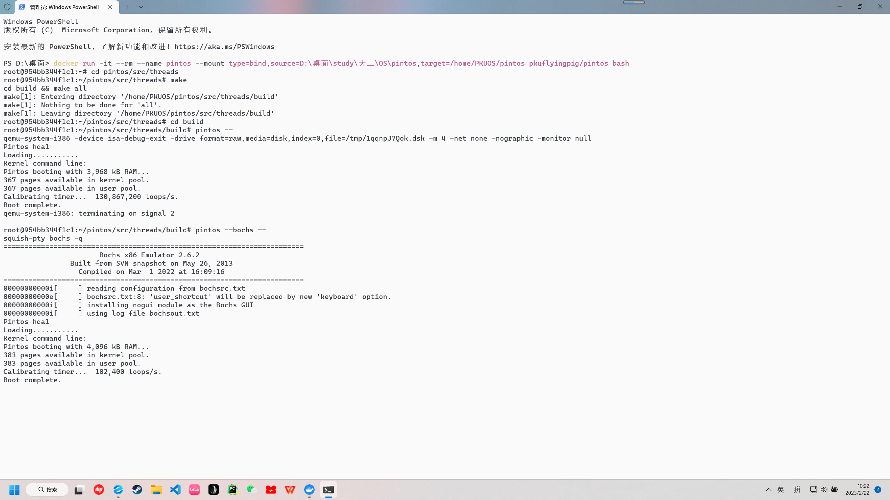
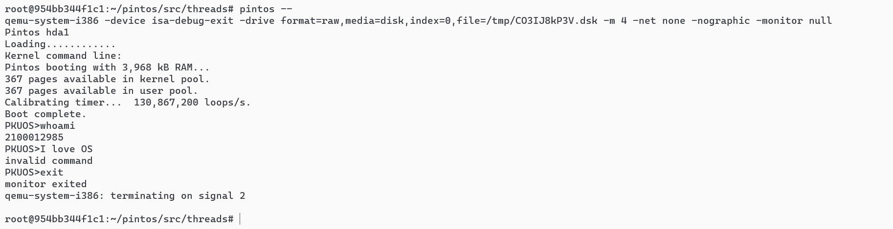

# Project 0: Getting Real

## Preliminaries

>Fill in your name and email address.

罗兆丰 <2100012985@stu.pku.edu.cn>

>If you have any preliminary comments on your submission, notes for the TAs, please give them here.

>Please cite any offline or online sources you consulted while preparing your submission, other than the Pintos documentation, course text, lecture notes, and course staff.

## Booting Pintos

>A1: Put the screenshot of Pintos running example here.

## Debugging

#### QUESTIONS: BIOS 

>B1: What is the first instruction that gets executed?

add    %al,(%eax)

>B2: At which physical address is this instruction located?

0x0000fff0

#### QUESTIONS: BOOTLOADER

>B3: How does the bootloader read disk sectors? In particular, what BIOS interrupt is used?

调用名为read_sector的函数。该函数使用了“int $0x13”中断来进行读取。

>B4: How does the bootloader decides whether it successfully finds the Pintos kernel?

首先通过检查磁盘的MBR signature是否为0xaa55来确定该磁盘是否分区，若不是则前往下一块磁盘。然后检查当前分区是否使用。然后通过“cmpb $0x20, %es:4(%si)”检查是否为Pintos kernel。最后通过“cmpb $0x80, %es:(%si)”检查该分区是否为bootable的。当以上检查均通过后，说明找到了Pintos kernel。

>B5: What happens when the bootloader could not find the Pintos kernel?

输出“Not found”，然后触发一个int $0x18的中断。

>B6: At what point and how exactly does the bootloader transfer control to the Pintos kernel?
 
首先bootloader使用read__sector读取磁盘内容并放在从0x20000开始的内存位置，随后将位于ELF header的0x18处的kernel入口指针放在内存的start位置处，最后执行跳转到start位置将控制转移给Pintos kernel。

#### QUESTIONS: KERNEL

>B7: At the entry of pintos_init(), what is the value of expression `init_page_dir[pd_no(ptov(0))]` in hexadecimal format?

该值为0x0

>B8: When `palloc_get_page()` is called for the first time,

>> B8.1 what does the call stack look like?
>>
 使用bt查看调用栈，结果如下：

#0  palloc_get_page (flags=(PAL_ASSERT | PAL_ZERO)) at ../../threads/palloc.c:113

#1  0xc00203aa in paging_init () at ../../threads/init.c:168

#2  0xc002031b in pintos_init () at ../../threads/init.c:100

#3  0xc002013d in start () at ../../threads/start.S:180

>> B8.2 what is the return value in hexadecimal format?
>>
使用fin运行至函数结束，返回值为(void *) 0xc0101000

>> B8.3 what is the value of expression `init_page_dir[pd_no(ptov(0))]` in hexadecimal format?
>>
该值仍为0x0

>B9: When palloc_get_page() is called for the third time,

>> B9.1 what does the call stack look like?
>>
使用c命令两次，重复上述命令，可得：

#0  palloc_get_page (flags=PAL_ZERO) at ../../threads/palloc.c:113

#1  0xc0020a81 in thread_create (name=0xc002e895 "idle", priority=0, function=0xc0020eb0 <idle>, aux=0xc000efbc) at ../../threads/thread.c:178

#2  0xc0020976 in thread_start () at ../../threads/thread.c:111

#3  0xc0020334 in pintos_init () at ../../threads/init.c:119

#4  0xc002013d in start () at ../../threads/start.S:180
>> B9.2 what is the return value in hexadecimal format?
>>
(void *) 0xc0103000

>> B9.3 what is the value of expression `init_page_dir[pd_no(ptov(0))]` in hexadecimal format?
>>
该值为0x102027

## Kernel Monitor

>C1: Put the screenshot of your kernel monitor running example here. (It should show how your kernel shell respond to `whoami`, `exit`, and `other input`.)

#### 

>C2: Explain how you read and write to the console for the kernel monitor.

使用input_getc()来逐个字符地获取输入，使用printf()来进行输出
