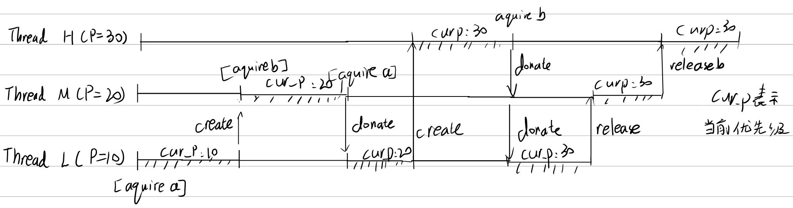

# Project 1: Threads

## Preliminaries

>Fill in your name and email address.

罗兆丰 <2100012985@stu.pku.edu.cn>

>If you have any preliminary comments on your submission, notes for the
>TAs, please give them here.

>Please cite any offline or online sources you consulted while
>preparing your submission, other than the Pintos documentation, course
>text, lecture notes, and course staff.

## Alarm Clock

#### DATA STRUCTURES

>A1: Copy here the declaration of each new or changed struct or struct member, global or static variable, typedef, or enumeration.  Identify the purpose of each in 25 words or less.

struct sleep_thread

{
  
  struct thread *t;
  struct list_elem elem;

}; // list element of sleeping threads

static struct list sleep_list; // list of sleeping threads

int64_t sleep_ticks; // new member variable in thread struct, used to record remaining sleep time

static void update_sleeping_thread(void); // sequentially checks the sleep thread list, updates the remaining sleep time and wakes up threads with zero sleep time

void update_one_sleeping_thread(struct thread *t, void *aux UNUSED); // decrease the remaining sleep time for a specific thread t, wake it up if the remaining time is zero

#### ALGORITHMS

>A2: Briefly describe what happens in a call to timer_sleep(),
>including the effects of the timer interrupt handler.

timer_sleep(): If the argument is negative, the function returns immediately. Otherwise, it sets the thread's sleep_ticks and adds it to the sleep list. The thread is then blocked.

 In the timer interrupt handler, update_sleeping_thread() is called, which sequentially checks the sleep list, updates the remaining sleep time for each sleeping thread, and wakes up threads whose sleep time has reached 0.
>A3: What steps are taken to minimize the amount of time spent in
>the timer interrupt handler?

To minimize the amount of time spent in the timer interrupt handler, the sleep list is used to keep track of only the sleeping threads. Therefore, every time the timer interrupt occurs, only the sleeping threads need to be checked, and there is no need to scan all the threads.

#### SYNCHRONIZATION

>A4: How are race conditions avoided when multiple threads call
>timer_sleep() simultaneously?

Interrupts are disabled in timer_sleep(), so other threads cannot interrupt the current thread and cause multiple threads to modify the sleep_list simultaneously.

>A5: How are race conditions avoided when a timer interrupt occurs
>during a call to timer_sleep()?

Interrupts are disabled at the beginning of the function with intr_disable and re-enabled at the end of the function with intr_enable, so race conditions are avoided when a timer interrupt occurs during a call to timer_sleep().

#### RATIONALE

>A6: Why did you choose this design?  In what ways is it superior to
>another design you considered?

At first, I used a method of scanning all threads in the timer interrupt to update the sleep time, but this was inefficient and could not pass the two tests in the mlfqs. Therefore, I switched to this design, which involves creating a separate sleep_list to avoid unnecessary scanning. However, after completing 2.2, I still could not pass alarm_simultaneous. Looking at the test output, I found that it was taking too much time in priority. Therefore, I changed to only use sleep_list in mlfqs and scan all threads in other cases, which finally passed the tests.

## Priority Scheduling

#### DATA STRUCTURES

>B1: Copy here the declaration of each new or changed struct or struct member, global or static variable, typedef, or enumeration.  Identify the purpose of each in 25 words or less.

struct lock {

int max_priority; // A member variable for tracking the maximum priority of threads waiting for a lock

struct list_elem elem;// A list element for adding the lock to a thread's list
};

struct thread{

int base_priority;//A member variable to struct thread, used to keep track of the thread's original priority.

struct list lock_list;//A member variable to struct thread, used to keep track of the locks held by the thread.

struct lock *waiting_lock;//A member variable to struct thread, used to keep track of the lock the thread is waiting for.

}
>B2: Explain the data structure used to track priority donation.
>Use ASCII art to diagram a nested donation.  (Alternately, submit a
>.png file.)

When a thread attempts to acquire a lock and successfully acquires it, the lock is added to the thread's list of locks, struct list locks, since no other thread is holding the lock. If the thread is unable to acquire the lock, it waits on the semaphore and donates its priority to the thread that currently holds the lock, if its priority is lower. At the same time, the lock's priority member is updated to correspond to the highest priority of the threads attempting to acquire the lock. Priority donation is recursive to handle nested donations: a waiting thread donates its priority to the thread holding the lock, which in turn donates its priority to the thread holding the lock it is waiting for, and so on.

#### ALGORITHMS

>B3: How do you ensure that the highest priority thread waiting for
>a lock, semaphore, or condition variable wakes up first?

In sema_up(), the function uses list_min to find the waiter with the highest priority in waiters and wakes it up first.

In cond_signal(), the function uses list_min to find the thread with the highest priority in waiters and wakes it up first.

>B4: Describe the sequence of events when a call to lock_acquire()
>causes a priority donation.  How is nested donation handled?

When a call to lock_acquire() causes a priority donation, the following sequence of events occurs:

When a thread tries to acquire a lock and succeeds, the lock is added to its lock_list.
If a thread cannot acquire a lock and waits on a semaphore, it donates its priority to the thread holding the lock (if its priority is lower). The priority of the lock is also updated to the highest priority of the waiting threads.
Priority donation occurs recursively to handle nested donations: the waiting thread donates to the holder of the lock, who then donates to the holder of the lock it's waiting for, and so on.

In the example given above, when the thread with the highest priority, H, attempts to acquire lock b, a chain of priority donation occurs. First, lock b is held by M, so a donation is made, raising the priority of both b and M to 30. The program then recursively checks if there are any threads waiting for a lock held by M, and finds that thread L is waiting for lock a held by M, so another donation is made, raising the priority of both a and L to 30. This allows L to run and release lock a, allowing M to run and release lock b.

>B5: Describe the sequence of events when lock_release() is called
>on a lock that a higher-priority thread is waiting for.

When lock_release() is called on a lock that a higher-priority thread is waiting for, the following sequence of events occurs:

The thread that is releasing the lock (let's call it L) updates its priority to the highest priority of all locks it holds (if any) or its base_priority if it holds no locks.
sema_up() is called on the lock's semaphore, which raises the semaphore's value and unblocks the highest-priority thread waiting on it (in this case, the thread that was previously blocked by the lock L held).

#### SYNCHRONIZATION

>B6: Describe a potential race in thread_set_priority() and explain
>how your implementation avoids it.  Can you use a lock to avoid
>this race?

A potential race condition can occur in thread_set_priority(), where one thread (A) sets its own priority while another thread (B) interferes by setting the priority of A through donation, causing issues with the ready_list. To avoid this race, interrupts are disabled before calling thread_set_priority() and re-enabled afterwards.

A lock could also be used to prevent this race by forcing threads to acquire a "set priority lock" before setting any thread priorities, and releasing it only after all priorities have been set. However, this would incur more overhead than simply disabling interrupts.

#### RATIONALE

>B7: Why did you choose this design?  In what ways is it superior to
>another design you considered?

The design chosen for priority scheduling does not require a list of threads that need to donate their priority to another thread; instead, a list of locks held by each thread is used to determine the priority of each thread. The priority of a lock is updated to the highest priority of the waiting threads, and priority donation is performed recursively to handle nested donations. This simplifies the design and does not require additional data structures.

## Advanced Scheduler

#### DATA STRUCTURES

>C1: Copy here the declaration of each new or changed struct or struct member, global or static variable, typedef, or enumeration.  Identify the purpose of each in 25 words or less.

In the new header file fixed_point.h, there are many functions defined to implement the floating-point calculations required for the mlfqs scheduling algorithm. Additionally, the following data types are defined:

typedef int fixed_point: This typedef is used to define a fixed-point number as an integer value.
Within the struct thread declaration, two new members are added:

int nice: This member is used to store the "niceness" value of the thread, which is used in the mlfqs algorithm to determine the thread's priority.

fixed_point recent_cpu: This member is used to store the thread's recent CPU usage, which is also used in the mlfqs algorithm to determine the thread's priority.

A global variable is also added:

fixed_point load_avg: This variable is used to store the system load average, which is also used in the mlfqs algorithm to determine thread priorities.

#### ALGORITHMS

>C2: How is the way you divided the cost of scheduling between code
>inside and outside interrupt context likely to affect performance?

The cost of scheduling is divided between code inside and outside interrupt context. The mlfqs algorithm requires updating the current thread's recent_cpu every tick, updating all threads' priorities every 4 ticks, and updating load_avg and all threads' recent_cpu every second. To reduce the overhead of these updates, the current thread's priority is updated every 4 ticks, and all thread priorities are updated every second. These updates are performed in thread_tick.

#### RATIONALE

>C3: Briefly critique your design, pointing out advantages and
>disadvantages in your design choices.  If you were to have extra
>time to work on this part of the project, how might you choose to
>refine or improve your design?

The design is relatively simple to implement, requiring only minor changes to the struct thread declaration and no additional data structures.

However, the time complexity of updating thread priorities is relatively high, as each update requires scanning through all threads and reinserting them into the list in priority order.

To improve the design, a priority queue data structure, implemented as a heap, could be used to maintain threads in priority order. This would reduce the time complexity of updates to O(log n).

>C4: The assignment explains arithmetic for fixed-point math in
>detail, but it leaves it open to you to implement it.  Why did you
>decide to implement it the way you did?  If you created an
>abstraction layer for fixed-point math, that is, an abstract data
>type and/or a set of functions or macros to manipulate fixed-point
>numbers, why did you do so?  If not, why not?

I implemented fixed-point arithmetic using inline functions to reduce the overhead of function calls and to allow the compiler to optimize the code more effectively.

Because the kernel does not support floating-point arithmetic, fixed-point arithmetic is used to simulate the calculations required for the mlfqs scheduling algorithm. Integers are used to represent fixed-point numbers, with the fractional component represented by the lower bits of the integer. No abstraction layer was created for fixed-point math, as the implementation was relatively simple and did not require any additional data structures or functions.